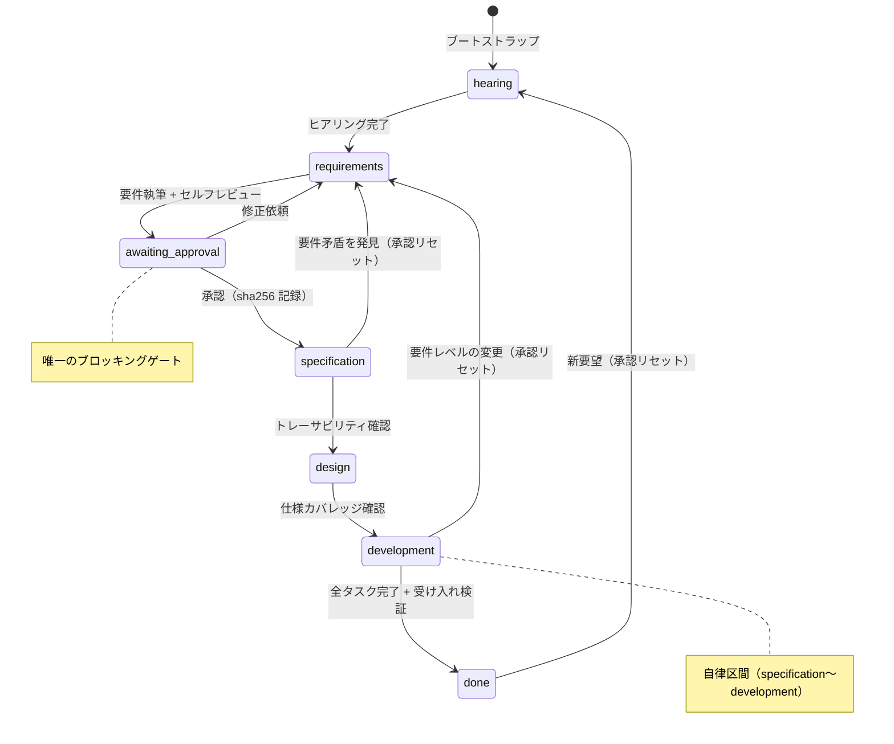
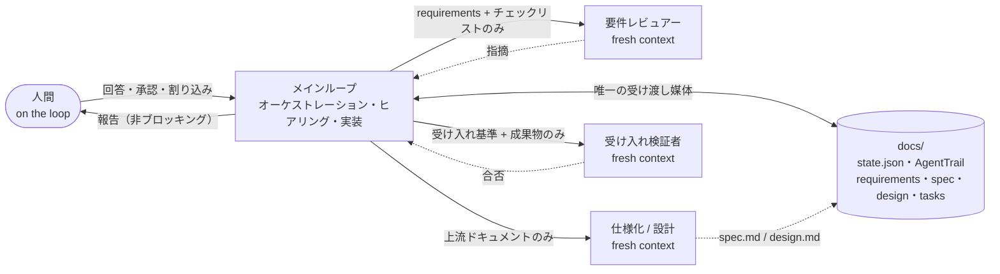

# human-on-the-loop

AI エージェント（Claude）が自律的にアプリ開発を進めるためのワークフローフレームワーク。

人間は「ループの中」ではなく「ループの上」にいる: 承認は**要件定義の一度だけ**。
それ以降（仕様化 → 設計 → 開発）はエージェントが自律的に完走し、人間は報告を受け取り、必要ならいつでも割り込める。

## ワークフロー

```
ヒアリング ──→ 要件定義 ──→ 【承認ゲート】──→ 仕様化 ──→ 設計 ──→ 開発 ──→ done
（対話）      （整合性チェック）  （人間・唯一）   └────── 自律区間（報告のみ・ブロックなし）──────┘
```

- **ヒアリング**: 5-whys・具体シナリオ・MVP スコープ交渉で「本当に欲しいもの」を掘り当てる。推測ドラフトを提示して一括訂正を求める propose-and-confirm 方式で往復を最小化。要求を超える改善は**提案**として提示し、採否はユーザーが決める
- **要件定義**: ID・受け入れ基準・出所（ユーザー / 提案）付きの要件に落とし、fresh context のレビュアーで矛盾・曖昧さ・テスト可能性・MECE をチェック
- **承認ゲート**: 人間が要件を承認。承認は requirements.md の sha256 付きで記録され、承認後に要件が書き換わると自律続行を拒否してゲートを再実行する
- **自律区間**: 仕様化（トレーサビリティ確認）→ 設計（技術選定・自己検証）→ 開発（タスク分解 → 実装 → テスト → セルフレビューのループ）。タスク3件ごとに中間報告
- **イテレーション**: done 後に新しい要望が来たら、差分ヒアリング → 要件更新 → 再承認 → 自律開発の次サイクル

### フェーズ遷移図



### 実行アーキテクチャ（コンテキスト分離）



## インストール

実体は `skills/hotl/` ディレクトリ1つ。ターゲットプロジェクトの `.claude/skills/hotl` に配置される。

```bash
# Claude Code プロジェクトへ
./install.sh --target ~/code/my-app

# フレームワーク開発中は symlink で（編集が即反映される）
./install.sh --target ~/code/my-app --link
```

## 使い方

- 新規開発: 「新しいアプリを作りたい」「◯◯を作って」
- 再開: 「続きから」「開発を進めて」（セッションが切れても state から正確に再開する）。ただし承認待ち中はこれらは承認とみなされず、ゲートが再提示される
- 状況確認: 「進捗を教えて」
- 介入: 自律区間の実行中でも、メッセージを送れば方針変更・停止として処理される

## 生成物（ターゲットプロジェクトの docs/ 配下）

| ファイル | 内容 |
|---|---|
| `hotl.state.json` | 機械可読の状態（現在フェーズ・承認記録・成果物パス）。再開の要 |
| `log.md` | **AgentTrail**: 追記専用の判断・行動証跡（report / decision / finding / approval / interrupt / proposal）。再開時の文脈復元と事後監査の正 |
| `hearing-notes.md` | ヒアリングの構造化メモ |
| `requirements.md` | 要件定義書（承認対象） |
| `spec.md` | 仕様書（要件トレーサビリティ表付き） |
| `design.md` | 設計書（技術選定の理由・代替案付き） |
| `tasks.md` | タスクバックログ。チェックボックスが進捗の唯一の真実 |

## 設計メモ

思想レベルの原則（human-on-the-loop・提案責務・AgentTrail・コンテキスト分離・再開性・検証・lean）と、フレームワーク自体の変更プロセスは **[PRINCIPLES.md](PRINCIPLES.md) を正とする**。以下は実装上の決定:

- **D1**: スキルは `hotl` の1つだけ。SKILL.md はステートマシンで、フェーズの詳細は `playbooks/` を随時 Read する（フェーズ別スキルの連鎖はセッション再開に脆い）
- **D2**: `skills/hotl/` が配布単位。playbook・テンプレートを同梱し、インストール＝ディレクトリ1つのコピー
- **D3**: 状態はターゲット側に置く。機械可読（state.json）と人間可読（log.md）を分離
- **D4**: 承認はコンテンツハッシュ付き。承認後の要件改変を検知してゲートを再実行（tamper-evident）
- **D5**: 要件レビューは fresh context のサブエージェントに要件とチェックリストだけを渡す（作成者バイアス排除）
- **D6**: タスク進捗は tasks.md のチェックボックスが唯一の真実。state.json には持たせない
- **D7**: コンテキスト分離 — フェーズ間の受け渡しは docs/ の成果物ドキュメントのみで、会話履歴を下流に持ち込まない。仕様化・設計は必要なドキュメント（上流成果物、差分更新時は既存成果物と変更差分の要約）だけを渡した fresh サブエージェントで実行し、レビュー（要件）と受け入れ検証（開発完了時）も必ず作成者と別コンテキストで行う。実装ループだけは分割しない（コード知識の連続性を優先）。モデルは全役割ともセッションモデルを継承
- **D8**: 文書の深さはプロジェクト規模に比例させる。イテレーション・再開時は既存成果物の差分更新で、テンプレートから再生成しない
